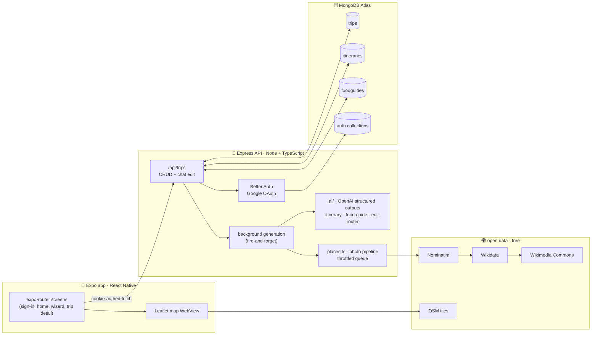

# Tripora ✈️

**AI travel planner.** Tell Tripora where you're going, for how long, your budget, what you're into — and anything else in your own words. It generates a day-by-day itinerary of real places with photos, pins them on a map, curates a food guide for the city, and lets you reshape everything by chatting with it.

Built with React Native (Expo) + Express + MongoDB + OpenAI. Place photos come entirely from open data (OpenStreetMap, Wikidata, Wikimedia Commons) — no paid APIs.

> 🎬 **Demo video:** _coming soon_ <!-- TODO: drag your screen recording (.mp4) here on GitHub, or link it -->
>
> 🏗 **Architecture diagram:** see below <!-- TODO: optionally replace the mermaid diagram with docs/architecture.png -->

---

## Features

- **Google sign-in** — Better Auth with the Expo plugin; session cookie stored in SecureStore.
- **5-step trip wizard** — destination, duration, budget (slider + presets + free input), activity picks, and a free-text "wishes" step whose words are fed straight into the AI prompt and outrank the generic picks.
- **AI itinerary** — one themed entry per day with Morning / Afternoon / Evening stops: real places, warm descriptions, practical prep tips, approximate coordinates. Generated in the background with OpenAI structured outputs (strict JSON schema), so saving a trip returns instantly.
- **AI food guide** — 8–12 real restaurants, cafés, bars, street food and markets with *what to try* at each, tagged **Must try**, **Locals' favourite**, **Michelin star**, **Top rated**, **Hidden gem**, **Budget friendly**.
- **Chat editing** — "no plans for day 3 evening, I have a flight", "swap day 1 and day 2", "swap the bar for a rooftop one". A small classifier call routes each message to the itinerary editor or the food-guide editor; edits are surgical and every reply explains what changed.
- **Maps** — Leaflet + OpenStreetMap inside a WebView: every stop pinned with a photo popup, a horizontally scrollable card strip with thumbnails, and one-tap Google Maps navigation to any stop.
- **Place photos for free** — a pipeline over open data: Nominatim geocoding → OSM entity tags → Wikidata image (P18) / Wikimedia Commons → geotagged Commons photos near the coordinates as fallback, with rate-limit throttling and a relevance check so a wrong photo never ships.
- **Calendar export** — any stop becomes a Google Calendar event: AI-written prep note (editable), native date & time pickers, maps link in the event description. No calendar permissions needed.
- **Trip management** — home screen with destination images, edit + regenerate, delete with cascade, pull-to-refresh, empty states, and a floating bubble menu.

## Architecture

<!-- TODO: replace with docs/architecture.png if you draw a custom one -->



**Flow:** saving a trip stores it and responds immediately; itinerary, food guide and photos generate in the background (the app shows a "crafting" state and re-fetches on demand). Each AI response is forced into a strict JSON schema, so nothing is parsed by hope. Itinerary and food guide live in separate collections keyed by `tripId` — their absence *is* the "still generating" state.

## Interesting bits

- **Structured outputs everywhere** — every OpenAI call (`gpt-5-mini`, Responses API) declares a strict JSON schema with `additionalProperties: false`, so itineraries, food guides, edits and even the edit-intent router always come back valid and typed.
- **Zero-cost image pipeline** — the naive approach (search Wikipedia by name) returned confidently wrong photos (a US Navy ship for a river cruise). The fix: geocode the exact entity first, prefer its curated Wikidata image, then fall back to geotagged Commons photos near the coordinates with a filename relevance check — wrong-place photos are rejected rather than shipped.
- **Polite API citizenship** — all open-data calls flow through one promise-chained throttle queue (1 req/s) with a proper User-Agent, matching Nominatim's and Wikimedia's usage policies.
- **Intent-routed chat edits** — a cheap classifier call decides whether a message edits the day plan or the food guide, so each message changes exactly one artifact and existing photos are reused by place name instead of re-fetched.
- **No state library** — screens fetch their own data on focus; the wizard is one page of dumb step components with local state. Deleting Zustand made the app smaller and simpler.

## Tech stack

| Layer | Tech |
| --- | --- |
| App | Expo SDK 57 · React Native 0.86 · React 19 · TypeScript (strict) · expo-router · NativeWind (Tailwind) · Reanimated 4 · phosphor icons |
| Auth | Better Auth 1.7 + `@better-auth/expo` · Google OAuth · SecureStore |
| API | Node 24 · Express 5 · TypeScript (strict, ESM) · Mongoose 9 |
| AI | OpenAI Responses API (`gpt-5-mini`) with strict JSON-schema structured outputs |
| Data | MongoDB Atlas |
| Maps & photos | Leaflet + OpenStreetMap · Nominatim · Wikidata · Wikimedia Commons |

## Repositories

| Repo | What |
| --- | --- |
| `Tripora` (this repo) | Expo app |
| `Tripora-backend` | Express API, AI generation, photo pipeline |

<!-- TODO: turn the repo names above into GitHub links -->

## Running locally

**Backend** (`Tripora-backend/`):

```bash
npm install
cp .env.example .env   # fill in the values below
npm run dev
```

| Env var | Purpose |
| --- | --- |
| `MONGODB_URI` | MongoDB / Atlas connection string |
| `BETTER_AUTH_SECRET` | `openssl rand -base64 32` |
| `BETTER_AUTH_URL` | `http://localhost:3000` |
| `GOOGLE_CLIENT_ID` / `GOOGLE_CLIENT_SECRET` | Google OAuth web client (redirect URI `http://localhost:3000/api/auth/callback/google`) |
| `OPENAI_API_KEY` | itinerary + food generation |

**App** (this repo):

```bash
npm install
npx expo start
```

On an Android emulator, forward the API port once so the app reaches `localhost:3000`:

```bash
adb reverse tcp:3000 tcp:3000
```

## Screens

Sign-in → Home (trip cards with photos, bubble menu) → Plan wizard (5 steps) → Trip detail with four tabs: **Itinerary** (day-by-day timeline, per-stop Calendar + Map actions), **Map** (all stops pinned), **Food** (curated guide), **Edit** (chat assistant).
